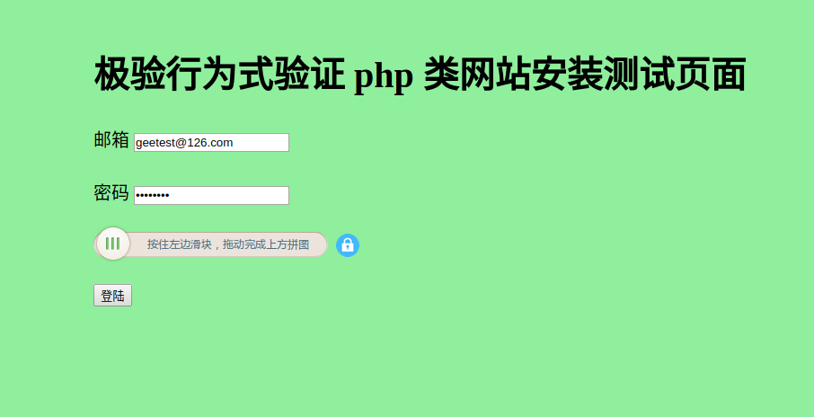

Geetest ruby sdk
================

Geetest是一个很不错的验证码组件，使用方便，安全性强。可惜没有ruby的sdk。于是顺手写了一个，由于实在太简单，所以没有做成gem，只留下实现和demo自取。

## 版本说明

目前，本SDK适用于 2.0

对于 3.0感兴趣的同学,建议查看官方网站: https://docs.geetest.com/install/overview/video

其中的视频讲解很不错哦!

## 如何使用demo

```
$ git clone
$ cd geetest_ruby_sdk
$ bundle install
$ bundle exec ruby geetest.rb

在浏览器中打开: http://localhost:4567 即可. 就会看到下图 所示:



在该页面, 如果用户手动拖拽的结果不正确,就会返回 "验证码不正确"

如果用户手动拖拽的结果正确, 就会返回 "验证码正确, 请进行下一步的验证 用户名和邮箱的工作"

```

## 如何在rails项目中使用geetest

将geetest_ruby_sdk.rb拷贝至lib目录

```html
在view页面加上
<script type="text/javascript" src="http://api.geetest.com/get.php?gt=id"></script>
```
其中id为geetest的公钥，这是要注册后才能得到的

```ruby
# in your controller action

require 'geetest_ruby_sdk'

challenge = params[:geetest_challenge] || ''
validate = params[:geetest_validate] || ''
seccode = params[:geetest_seccode] || ''

# 将私钥传入，要注册的
sdk = GeetestSDK.new('private key')
if sdk.validate(challenge, validate, seccode)
	do something
else
	do something
end #if
```

## 如何在sinatra项目中使用geetest

将geetest_ruby_sdk.rb拷贝至当前路径

```ruby
# app.rb
require 'sinatra'
require './geetest_ruby_sdk'

get '/' do
	send_file 'login.html'
end

post '/log' do
	challenge = params[:geetest_challenge] || ''
	validate = params[:geetest_validate] || ''
	seccode = params[:geetest_seccode] || ''

	# 将私钥传入，要注册的
	sdk = GeetestSDK.new('private key')
	if sdk.validate(challenge, validate, seccode)
		'successfully'
	else
		'Can not validate'
	end #if
end
```


